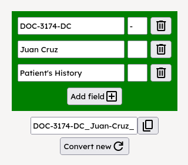

## title2filename-js

Tool for generating filenames from texts, or group of texts, particularly containing special characters.

🔗 [Working Demo v1.0](https://ephemeral-cucurucho-67de81.netlify.app)

### Notes for Contributors

The frontend application is contained under the `frontend-nuxt` subdirectory.
To run it in your local machine, use `cd frontend-nuxt` first before running `yarn dev`.